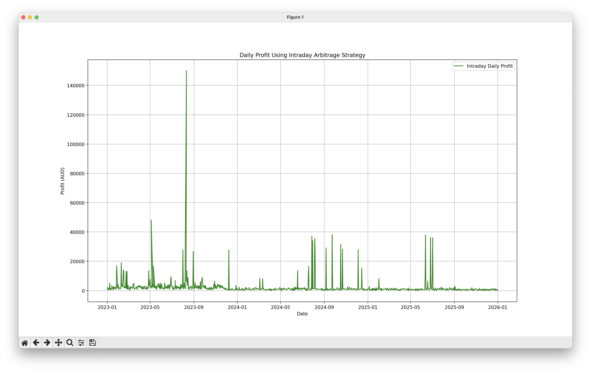
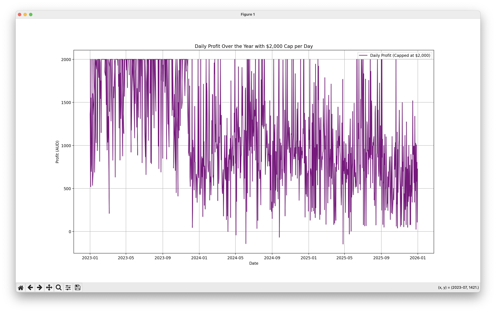
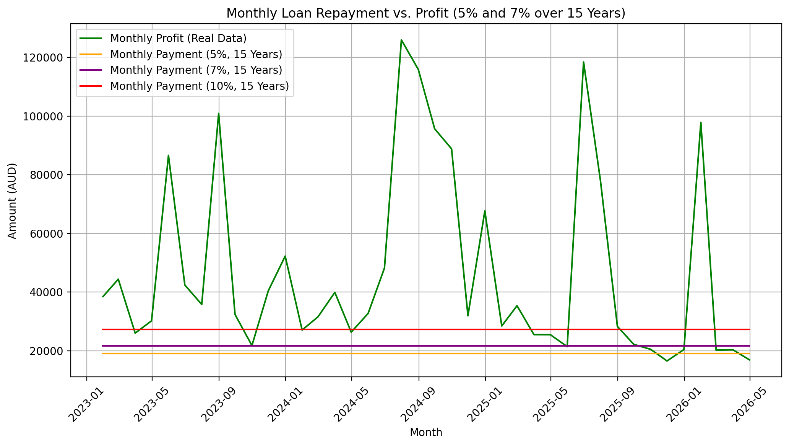
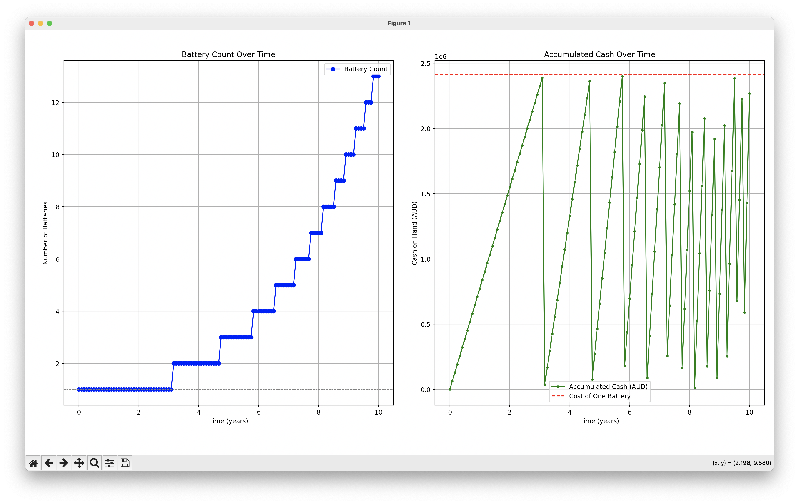

# Community battery project
Assessing the feasibility of installing a big community battery. 50% of the proceeds from the first battery would go towards buying a second battery, the other 50% paying electricity forwards to low-income families.

## Project goals
* Soak up South Australian daytime solar
* Reduce morning/evening grid load
* Encourage local community rooftop solar installation
* Reduce energy inequity

## Organisation setup
* [Setting up a not-for-profit](https://www.ato.gov.au/businesses-and-organisations/not-for-profit-organisations/getting-started/starting-an-nfp)

Legal Structure: Incorporated association

Questions to answer:
* **What will your organisation try to achieve?** Energy equity.
* **What will its main activities be?** Buying battery storage.
* **What programs or services will you provide?** Structure for accepting grants, and purchasing batteries.
* **Who is your target audience?** Community groups.
* **Who will benefit from the organisation's activities and programs?** Low income families, home owners with solar.
* **Why is there a need for this new organisation?** To insulate individuals and other organisations from unexpected disruption of battery cost to profit.
* **How long will your NFP organisation or charity last? Will it be for a one-off short-term project or operating on an ongoing basis?** Ongoing, until battery profits don't cover life-cycle costs.

Next steps:
* Write a business plan.
* Choose six founding members, including a president, secretary, treasurer.
* Apply for an ABN.
* Register the not-for-profit.
* Apply for DGR charity status.
* Organise a location.
* Order the battery.

## Documentation
* [Neighbourhood Battery Knowledge Hub](https://bsgip.com/knowledge-hub-landing-page/)
* [How to run a Neighbourhood Battery project](https://www.energy.vic.gov.au/grants/neighbourhood-batteries/how-to-run-a-neighbourhood-battery-project)
* [Community Batteries for Household Solar program](https://www.dcceew.gov.au/energy/renewable/community-batteries)
* [Neighbourhood batteries in Australia: Anticipating questions of value conflict and (in)justice](https://www.researchgate.net/publication/359314754_Neighbourhood_batteries_in_Australia_Anticipating_questions_of_value_conflict_and_injustice)
* [Rooftop solar density map](https://pv-map.apvi.org.au/historical#11/-34.9383/138.5898)
* [SA Power Networks community batteries project](https://www.talkingpower.com.au/community-batteries-project)
* [2024 Megapack pricing down 44%](https://www.pv-magazine-australia.com/2024/07/08/tesla-battery-deployment-up-157-megapack-pricing-down-44/)
* [Big Battery Storage Map of Australia](https://reneweconomy.com.au/big-battery-storage-map-of-australia/)
* [Network Opportunity Maps](https://www.energynetworks.com.au/projects/network-opportunity-maps/accessing-the-network-opportunity-maps/)

## Requests for advice
* City of Burnside (14th November 2024)
* Tesla Energy (20th November 2024)
* Bank Australia (20th November 2024 - replied 27th November, loan possible)
* Edwardstown community battery project (20th November 2024)
* Energy Locals (23rd March 2025)
* SA Power Networks (23rd March 2025 - replied 24th March, no information possible, contact local electrical installer)
* DQ Electrical (26th March 2025 - replied 27th March, will arrange a quote for installation/connection)

## Finance
Upfront costs, power costs, and payback time estimates.

### Grants and similar projects
* [Community Battery Funding Round 2 - due 30 April 2025](https://arena.gov.au/funding/community-batteries-funding-round-2/)
* [SA Power Networks community grants](https://www.sapowernetworks.com.au/about-us/community/communitygrants/)
* [SA Gov + SAPN + City of Marion got $500K for a community battery and free land](https://www.makingmarion.com.au/edwardstown-community-battery)
* [Bank Australia community grants](https://www.bankaust.com.au/community-customer-grants)
* [Fitzroy North Community Battery (120kW/309kWh)](https://www.yef.org.au/app/uploads/2025/01/FN1-Year-2-Performance-Report.pdf)
* [Momentum Energy](https://www.momentumenergy.com.au/blog/battery-benefits-for-organisations-and-community)

### Electricity price
[AEMO dashboard](https://aemo.com.au/en/energy-systems/electricity/national-electricity-market-nem/data-nem/data-dashboard-nem) average monthly prices for 2024 in South Australia:
* Low: AUD$32.74/MWh January 2024
* High: AUD$241.22/MWh July 2024
* Average: AUD$78.56/MWh 2024

### Tesla Megapack cost
Upfront cost: 5/11/2024
* [1.9 MW, 3.9 MWh pack](https://www.tesla.com/megapack/design) US$1.03M == ~AUD$1.56M
* Annual maintenance: US$8,830 == ~AUD$13,400
* 92% round trip efficiency
* Dimensions: width 8.81m, depth 1.65m, height 2.79m

### Insurance
Would we need these types of cover? What is the approximate % vs insured value?
* Property Insurance
* Public Liability Insurance
* Business Interruption Insurance
* Construction All-Risks (CAR) Insurance

### Payback calculated on archived trading data
Assuming the Megapack cost including installation is AUD$2,414,070 and annual maintenance cost of AUD$15,000.
* Source: [AEMO archive](https://visualisations.aemo.com.au/aemo/nemweb/index.html#mms-data-model)
* Add monthly archive URLs to [data/download.sh](data/download.sh). The year folder must match the month.
* Data directory: [data](data)
* SA1 combined: [trading-price-sa1.csv.zip](data/trading-price-sa1.csv.zip)
* Run `make setup` once, then `make run` after adding months. This downloads missing archives, merges SA1 rows chronologically, refreshes the combined CSV/ZIP and four PNGs, and replaces the output below.
* The trailing midnight interval on the first of the next month is omitted, so it does not create an extra near-zero month in the loan plot.
* Downloads are cached in `data/archives/`; delete an individual cached ZIP to fetch it again. `make data` refreshes only the data. Failed downloads or invalid archives stop the run before replacing the combined data.





**Output**:

```bash
venv/bin/python payback.py
===========================
Morning and evening sell...
===========================
Daily Profit: 491.2991248629386
Annual Profit: 179324.1805749726
Payback Period (years): 14.69089936461655


venv/bin/python payback_evening_only.py
====================
Evening sell only...
====================
Optimized Buy Hour: 13
Optimized Sell Hour: 18
Daily Profit (Single Buy/Sell): 969.6231823601972
Annual Profit (Single Buy/Sell): 353912.461561472
Payback Period (years, Single Buy/Sell): 7.122989779949816


venv/bin/python payback_evening_morning_optional.py
=========================================================================
Evening sell, and morning if the price overnight is less than $100/MWh...
=========================================================================
Optimized Buy Hour (Midday): 13
Optimized Sell Hour (Evening): 18
Overnight Charging: True
Daily Profit (Including Morning Sell): 1055.2047889386422
Annual Profit: 385149.7479626044
Payback Period (years): 6.521873953143659


venv/bin/python payback_intraday.py

Buy Actions Log (first 10):
Buy at -47.78 AUD/MWh, Amount: 0.78 MWh, Battery State: 0.78 MWh
Buy at -55.41 AUD/MWh, Amount: 0.78 MWh, Battery State: 1.56 MWh
Buy at -46.45 AUD/MWh, Amount: 0.78 MWh, Battery State: 2.34 MWh
Buy at -57.37 AUD/MWh, Amount: 0.78 MWh, Battery State: 3.12 MWh
Buy at -52.01 AUD/MWh, Amount: 0.78 MWh, Battery State: 3.90 MWh
Buy at -61.93 AUD/MWh, Amount: 0.78 MWh, Battery State: 0.78 MWh
Buy at -63.01 AUD/MWh, Amount: 0.78 MWh, Battery State: 1.56 MWh
Buy at -61.93 AUD/MWh, Amount: 0.78 MWh, Battery State: 2.34 MWh
Buy at -63.01 AUD/MWh, Amount: 0.78 MWh, Battery State: 3.12 MWh
Buy at -87.72 AUD/MWh, Amount: 0.78 MWh, Battery State: 3.90 MWh

Sell Actions Log (first 10):
Sell at 142.21 AUD/MWh, Amount: 0.78 MWh, Battery State: 3.12 MWh
Sell at 152.36 AUD/MWh, Amount: 0.78 MWh, Battery State: 2.34 MWh
Sell at 145.26 AUD/MWh, Amount: 0.78 MWh, Battery State: 1.56 MWh
Sell at 155.39 AUD/MWh, Amount: 0.78 MWh, Battery State: 0.78 MWh
Sell at 177.40 AUD/MWh, Amount: 0.78 MWh, Battery State: 0.00 MWh
Sell at 108.59 AUD/MWh, Amount: 0.78 MWh, Battery State: 3.12 MWh
Sell at 120.89 AUD/MWh, Amount: 0.78 MWh, Battery State: 2.34 MWh
Sell at 126.35 AUD/MWh, Amount: 0.78 MWh, Battery State: 1.56 MWh
Sell at 108.39 AUD/MWh, Amount: 0.78 MWh, Battery State: 0.78 MWh
Sell at 103.77 AUD/MWh, Amount: 0.78 MWh, Battery State: 0.00 MWh

Daily Summary Log (first 10):
Date: 2023-01-01, Total Buy: 3.90 MWh, Total Buy Cost: -202.04 AUD, Total Sell: 3.90 MWh, Total Sell Revenue: 602.64 AUD, Daily Profit: 804.68 AUD
Date: 2023-01-02, Total Buy: 3.90 MWh, Total Buy Cost: -263.33 AUD, Total Sell: 3.90 MWh, Total Sell Revenue: 443.03 AUD, Daily Profit: 706.36 AUD
Date: 2023-01-03, Total Buy: 3.90 MWh, Total Buy Cost: -260.36 AUD, Total Sell: 0.00 MWh, Total Sell Revenue: 0.00 AUD, Daily Profit: 260.36 AUD
Date: 2023-01-04, Total Buy: 3.90 MWh, Total Buy Cost: -299.52 AUD, Total Sell: 7.80 MWh, Total Sell Revenue: 212.83 AUD, Daily Profit: 512.35 AUD
Date: 2023-01-05, Total Buy: 3.90 MWh, Total Buy Cost: -238.46 AUD, Total Sell: 3.90 MWh, Total Sell Revenue: 145.53 AUD, Daily Profit: 383.99 AUD
Date: 2023-01-06, Total Buy: 3.90 MWh, Total Buy Cost: -443.06 AUD, Total Sell: 3.90 MWh, Total Sell Revenue: 263.43 AUD, Daily Profit: 706.49 AUD
Date: 2023-01-07, Total Buy: 3.90 MWh, Total Buy Cost: -311.26 AUD, Total Sell: 3.90 MWh, Total Sell Revenue: 2986.41 AUD, Daily Profit: 3297.67 AUD
Date: 2023-01-08, Total Buy: 3.90 MWh, Total Buy Cost: -219.93 AUD, Total Sell: 3.90 MWh, Total Sell Revenue: 1937.21 AUD, Daily Profit: 2157.14 AUD
Date: 2023-01-09, Total Buy: 3.90 MWh, Total Buy Cost: -126.95 AUD, Total Sell: 3.90 MWh, Total Sell Revenue: 525.96 AUD, Daily Profit: 652.91 AUD
Date: 2023-01-10, Total Buy: 3.90 MWh, Total Buy Cost: -171.49 AUD, Total Sell: 3.90 MWh, Total Sell Revenue: 527.08 AUD, Daily Profit: 698.57 AUD
====================================
Intraday Arbitrage Strategy Results:
====================================
Total Profit: $1879071.08
Annual Profit: $564030.38
Payback Period: 4.40 years
Monthly Payment (5% interest, 15-year term): $19090.31
Monthly Payment (7% interest, 15-year term): $21698.34
Monthly Payment (10% interest, 15-year term): $27211.29

Capped Profit Scenario ($2,000 Cap due to grid stabilisation) Results:
Total Profit (Capped at $2,000): $1108077.24
Annual Profit (Capped at $2,000): $332605.42
Payback Period (Capped at $2,000): 7.60 years
```

#### Hornsdale battery
Payback period was [under 3 years](https://reneweconomy.com.au/tesla-big-battery-recoups-cost-of-construction-in-little-over-two-years-25265/#:~:text=It%20also%20means%20that%20total,began%20operations%20in%20late%202017).

## Hardware
Community battery hardware options:
* [Tesla Megapack](https://www.tesla.com/en_au/megapack)

## Software
Control software options:
* [Tesla Energy Software](https://www.tesla.com/en_au/support/energy/tesla-software)
* Is there a commercial version of the [Tesla Fleet API](https://developer.tesla.com/docs/fleet-api/endpoints/energy)
* [Energy Autopilot](https://energyautopilot.com) when it launches?
