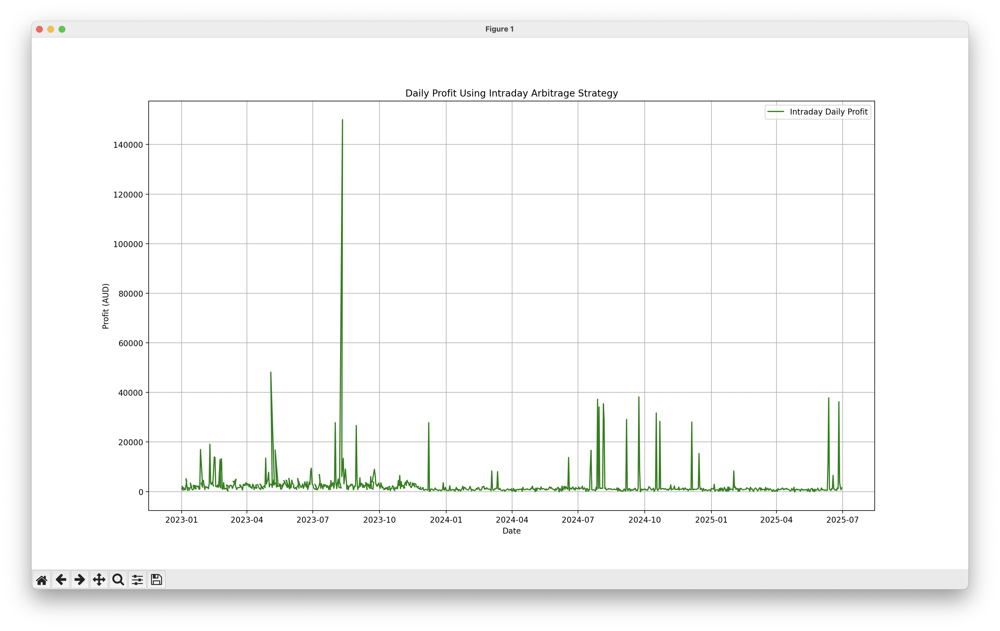

# Community battery project
Assessing the feasibility of installing a big community battery.

## Project goals
* Soak up South Australian daytime solar
* Reduce morning/evening grid load
* Encourage local community rooftop solar installation
* Reduce energy inequity

## Documentation
* [How to run a Neighbourhood Battery project](https://www.energy.vic.gov.au/grants/neighbourhood-batteries/how-to-run-a-neighbourhood-battery-project)
* [Community Batteries for Household Solar program](https://www.dcceew.gov.au/energy/renewable/community-batteries)
* [Neighbourhood batteries in Australia: Anticipating questions of value conflict and (in)justice](https://www.researchgate.net/publication/359314754_Neighbourhood_batteries_in_Australia_Anticipating_questions_of_value_conflict_and_injustice)
* [2024 Megapack pricing down 44%](https://www.pv-magazine-australia.com/2024/07/08/tesla-battery-deployment-up-157-megapack-pricing-down-44/)

## Finance
Upfront costs, power costs, and payback time estimates.

### Electricity price
[AEMO dashboard](https://aemo.com.au/en/energy-systems/electricity/national-electricity-market-nem/data-nem/data-dashboard-nem) average monthly prices for 2024 in South Australia:
* Low: AUD$32.74/MWh January 2024
* High: AUD$241.22/MWh July 2024
* Average: AUD$78.56/MWh 2024

### Tesla Megapack cost
Upfront cost: 5/11/2024
* [1.9 MW, 3.9 MWh pack](https://www.tesla.com/megapack/design) US$1.03M == ~AUD$1.56M
* Annual maintenance: US$8,830 == ~AUD$13,400
* 92% round trip efficiency

### Payback calculated on 2024 data so far
Assuming the Megapack cost including installation is AUD$2,414,070 and annual maintenance cost of AUD$15,000.
* Source: [AEMO archive](https://visualisations.aemo.com.au/aemo/nemweb/index.html#mms-data-model)
* Download the archived CSVs: [./download.sh](data/download.sh)
* Data directory: [data](data)
* SA1 combined: [trading-price-sa1.csv.zip](data/trading-price-sa1.csv.zip)
* Run the scripts: `make setup` and `make run`



**Output**:

```bash
venv/bin/python payback.py
===========================
Morning and evening sell...
===========================
Daily Profit: 666.927851688655
Annual Profit: 243428.66586635908
Payback Period (years): 10.568156981717602


venv/bin/python payback_evening_only.py
====================
Evening sell only...
====================
Optimized Buy Hour: 12
Optimized Sell Hour: 18
Daily Profit (Single Buy/Sell): 1405.2969927562633
Annual Profit (Single Buy/Sell): 512933.4023560361
Payback Period (years, Single Buy/Sell): 4.848178468400627


venv/bin/python payback_evening_morning_optional.py
=========================================================================
Evening sell, and morning if the price overnight is less than $100/MWh...
=========================================================================
Optimized Buy Hour (Midday): 12
Optimized Sell Hour (Evening): 18
Overnight Charging: True
Daily Profit (Including Morning Sell): 1572.621368668672
Annual Profit: 574006.7995640653
Payback Period (years): 4.31849845454936


venv/bin/python payback_intraday.py

Buy Actions Log (first 10):
Buy at -84.69 AUD/MWh, Amount: 0.78 MWh, Battery State: 0.78 MWh
Buy at -88.56 AUD/MWh, Amount: 0.78 MWh, Battery State: 1.56 MWh
Buy at -85.83 AUD/MWh, Amount: 0.78 MWh, Battery State: 2.34 MWh
Buy at -86.74 AUD/MWh, Amount: 0.78 MWh, Battery State: 3.12 MWh
Buy at -87.77 AUD/MWh, Amount: 0.78 MWh, Battery State: 3.90 MWh
Buy at -59.42 AUD/MWh, Amount: 0.78 MWh, Battery State: 0.78 MWh
Buy at -58.48 AUD/MWh, Amount: 0.78 MWh, Battery State: 1.56 MWh
Buy at -54.07 AUD/MWh, Amount: 0.78 MWh, Battery State: 2.34 MWh
Buy at -54.07 AUD/MWh, Amount: 0.78 MWh, Battery State: 3.12 MWh
Buy at -58.17 AUD/MWh, Amount: 0.78 MWh, Battery State: 3.90 MWh

Sell Actions Log (first 10):
Sell at 59.31 AUD/MWh, Amount: 0.78 MWh, Battery State: 3.12 MWh
Sell at 65.98 AUD/MWh, Amount: 0.78 MWh, Battery State: 2.34 MWh
Sell at 58.46 AUD/MWh, Amount: 0.78 MWh, Battery State: 1.56 MWh
Sell at 61.21 AUD/MWh, Amount: 0.78 MWh, Battery State: 0.78 MWh
Sell at 64.47 AUD/MWh, Amount: 0.78 MWh, Battery State: 0.00 MWh
Sell at 74.07 AUD/MWh, Amount: 0.78 MWh, Battery State: 3.12 MWh
Sell at 78.16 AUD/MWh, Amount: 0.78 MWh, Battery State: 2.34 MWh
Sell at 84.04 AUD/MWh, Amount: 0.78 MWh, Battery State: 1.56 MWh
Sell at 82.32 AUD/MWh, Amount: 0.78 MWh, Battery State: 0.78 MWh
Sell at 80.14 AUD/MWh, Amount: 0.78 MWh, Battery State: 0.00 MWh

Daily Summary Log (first 10):
Date: 2024-01-01, Total Buy: 3.90 MWh, Total Buy Cost: -338.20 AUD, Total Sell: 3.90 MWh, Total Sell Revenue: 241.36 AUD, Daily Profit: 579.56 AUD
Date: 2024-01-02, Total Buy: 3.90 MWh, Total Buy Cost: -221.68 AUD, Total Sell: 3.90 MWh, Total Sell Revenue: 311.01 AUD, Daily Profit: 532.69 AUD
Date: 2024-01-03, Total Buy: 4.68 MWh, Total Buy Cost: 171.42 AUD, Total Sell: 4.68 MWh, Total Sell Revenue: 606.04 AUD, Daily Profit: 434.62 AUD
Date: 2024-01-04, Total Buy: 3.90 MWh, Total Buy Cost: -148.50 AUD, Total Sell: 3.90 MWh, Total Sell Revenue: 279.79 AUD, Daily Profit: 428.30 AUD
Date: 2024-01-05, Total Buy: 3.90 MWh, Total Buy Cost: -160.21 AUD, Total Sell: 3.90 MWh, Total Sell Revenue: 299.12 AUD, Daily Profit: 459.33 AUD
Date: 2024-01-06, Total Buy: 6.24 MWh, Total Buy Cost: -27.19 AUD, Total Sell: 6.24 MWh, Total Sell Revenue: 2332.50 AUD, Daily Profit: 2359.69 AUD
Date: 2024-01-07, Total Buy: 3.90 MWh, Total Buy Cost: -170.25 AUD, Total Sell: 3.90 MWh, Total Sell Revenue: 405.47 AUD, Daily Profit: 575.72 AUD
Date: 2024-01-08, Total Buy: 3.90 MWh, Total Buy Cost: -106.73 AUD, Total Sell: 3.90 MWh, Total Sell Revenue: 393.14 AUD, Daily Profit: 499.86 AUD
Date: 2024-01-09, Total Buy: 3.90 MWh, Total Buy Cost: -162.72 AUD, Total Sell: 3.90 MWh, Total Sell Revenue: 603.89 AUD, Daily Profit: 766.61 AUD
Date: 2024-01-10, Total Buy: 3.90 MWh, Total Buy Cost: -186.46 AUD, Total Sell: 3.90 MWh, Total Sell Revenue: 681.86 AUD, Daily Profit: 868.32 AUD

====================================
Intraday Arbitrage Strategy Results:
====================================
Total Profit: $537007.85
Annual Profit: $712755.87
Payback Period: 3.46 years
```

#### Hornsdale battery
Payback period was [under 3 years](https://reneweconomy.com.au/tesla-big-battery-recoups-cost-of-construction-in-little-over-two-years-25265/#:~:text=It%20also%20means%20that%20total,began%20operations%20in%20late%202017).

### Payback back of the envelope estimate
Based on 2x manual two-hour Charge/discharge cycles via [Open Electricity](https://explore.openelectricity.org.au/energy/sa1/?range=7d&interval=30m&view=discrete-time&group=Detailed) for October 2024.

**Sell**:
* 6-8am ~AUD$75/MWh = AUD$150
* 6-8pm ~AUD$75/MWh = AUD$150

**Buy**:
* 12-2pm ~AUD$-100/MWh = AUD$200
* 10pm-12am ~AUD$50/MWh = AUD$-100

**Total**:
* ~AUD$400/day == AUD$146,000/year

**Payback time**:
* AUD$1,574,000 / AUD$146,000 = **10.8 years**

## Hardware
Community battery hardware options:
* [Tesla Megapack](https://www.tesla.com/en_au/megapack)

## Software
Control software options:
* [Tesla Energy Software](https://www.tesla.com/en_au/support/energy/tesla-software)
* Is there a commercial version of the [Tesla Fleet API](https://developer.tesla.com/docs/fleet-api/endpoints/energy)
* [Energy Autopilot](https://energyautopilot.com) when it launches?
